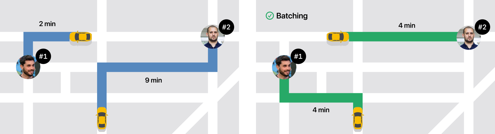
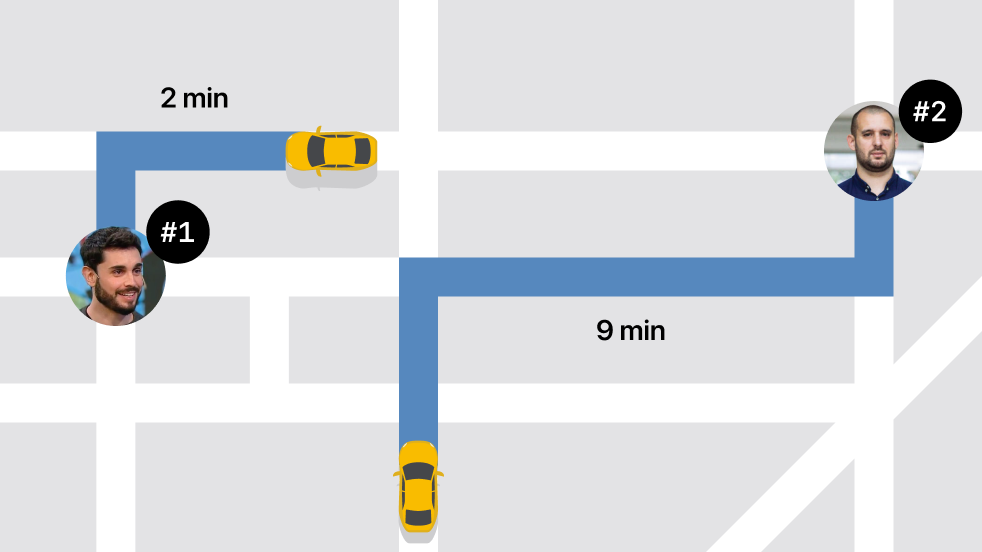
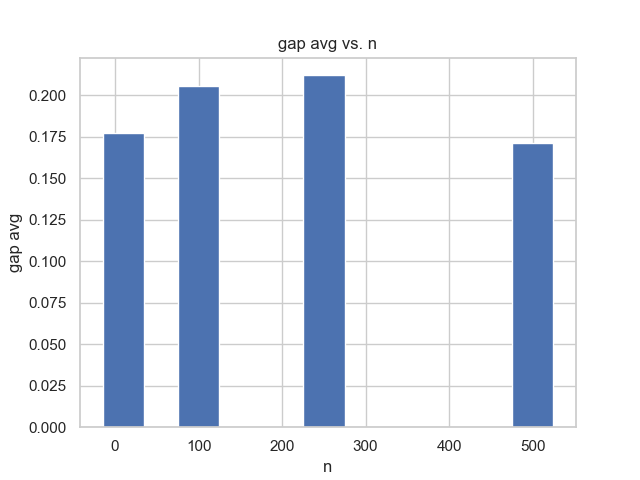
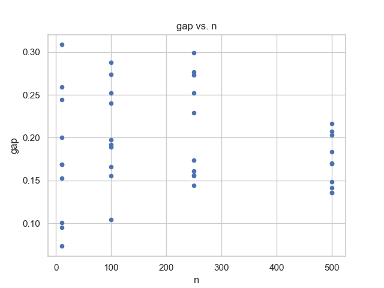
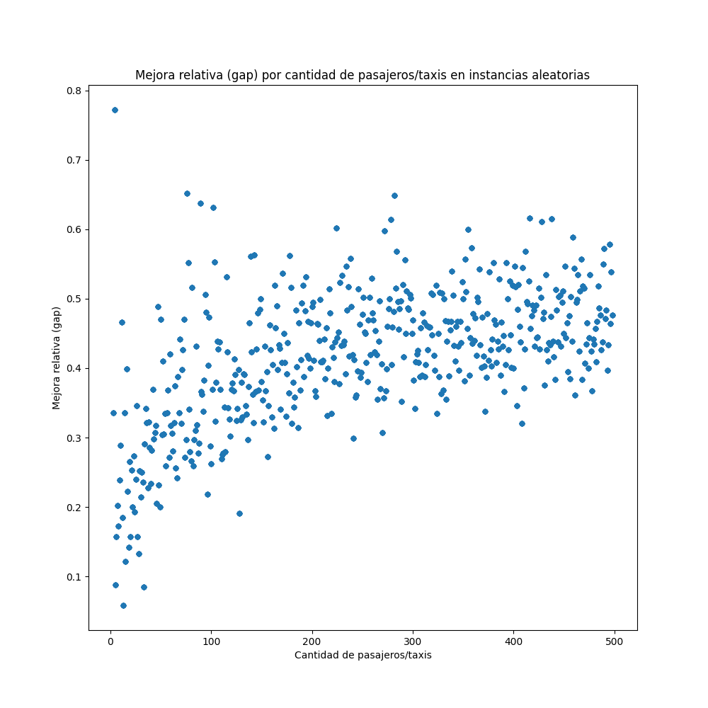
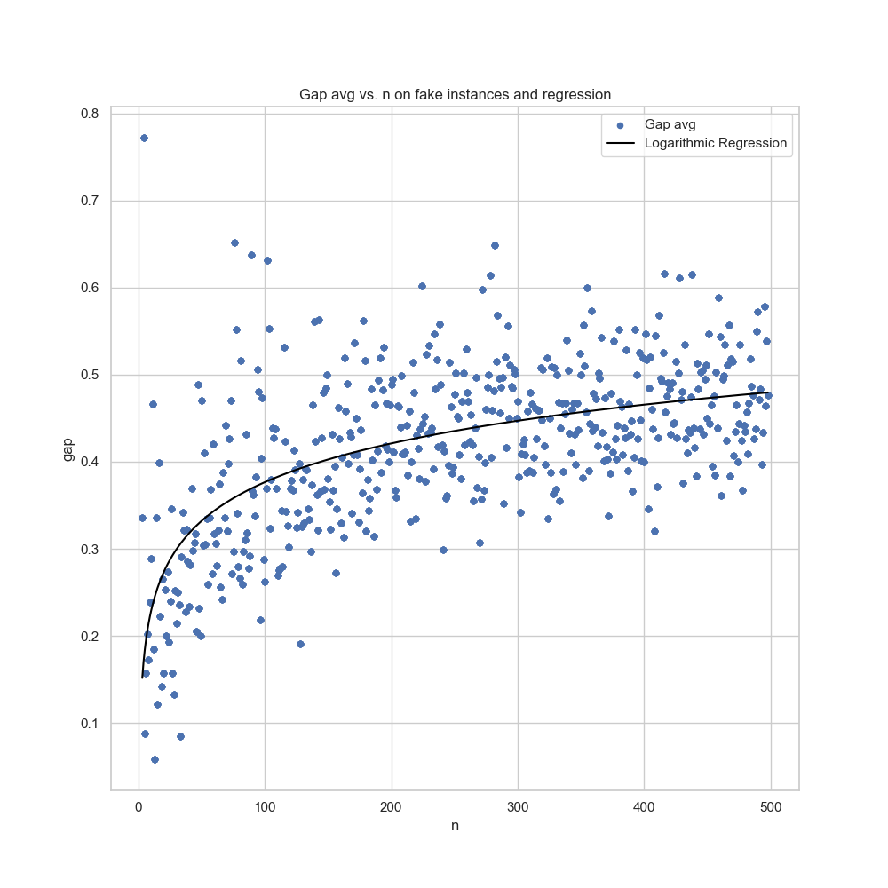
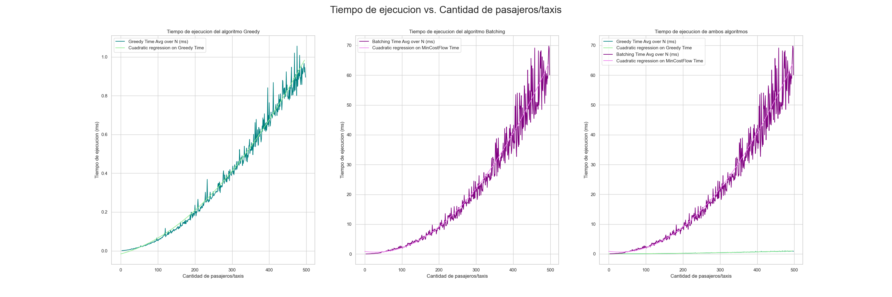

<!---->

\newpage

\newpage

## Introducción

La aparición masiva de plataformas durante los últimos años han modificado la forma en la que interactuamos con distintos servicios. Algunos ejemplos incluyen la compra on-line y el efecto en el retail tradicional; la planificación de vacaciones y reserva de alojamientos; el delivery de comidas y la realización de envíos de pequeña escala; y las nuevas soluciones de movilidad tanto sobre sistemas tradicionales, como los taxis, así como también plataformas colaborativas y de ride sharing. La masividad lograda por estas aplicaciones y plataformas se justifica no solo por los mejores precios, sino también por una mejora en la experiencia del usuario en distintos aspectos como la presencia de reviews, la comodidad en la utilización y la rápida respuesta con las respectivas soluciones. Sin embargo, es importante notar que estas diferencias no se producen solamente con ofrecer una app, sino que es el resultado de un proceso más complejo de análisis de distintos aspectos del servicio propuesto.
En este trabajo nos ponemos en el rol de consultores para una empresa que provee servicios de movilidad, cumpliendo el rol de matchmaker entre pasajeros y vehículos (taxis o particulares). En efecto, existen en el mercado local distintas alternativas de aplicaciones para conectar pasajeros con vehículos, con diversos niveles de éxito en términos de demanda y utilización. Nuestro objetivo es analizar un aspecto particular del proceso con decisiones que deben tomarse en tiempo real, evaluando el impacto en términos de la experiencia del usuario (tanto pasajeros como conductores) y de los potenciales costos involucrados.

## Descripción del problema y Motivación

En un instante dado (o en un intervalo muy pequeño de tiempo, digamos 10-15 segundos) y en una determinada área geográfica la empresa posee un número de pedidos de viajes a realizar y una cierta cantidad de vehículos disponibles para realizar viajes. Para cada pasajero podemos asumir la disponibilidad de un mínimo de información como

- el instante en el que realizó el pedido;
- la localización de origen del viaje (donde debe ser buscado);
- la localización de destino del viaje (donde debe ser llevado) o la distancia estimada del recorrido;
- una estimación de la tarifa total a cobrar por el viaje (que depende en parte de la distancia del recorrido, pero puede contener gastos extra como valijas, cantidad de pasajeros, horas pico, etc.).

Análogamente, también podemos asumir mínimamente conocer en tiempo real la localización de cada uno de los vehículos de nuestra flota, en particular la de aquellos que estén disponibles para realizar viajes. Combinando la localización de pasajeros y vehículos, podemos asumir también que conocemos la distancia a recorrer que le llevaría a cada vehículo llegar a cada posible cliente a fin de poder empezar el viaje. El problema que buscamos resolver es decidir que vehículo debe buscar a cada pasajero.
A fin de formular un modelo para la decisión en cuestión, primero formalizamos el problema. Tenemos n vehiculos disponibles, $i = 1, \dots ,n$ para cubrir n viajes de distintos pasajeros, $j = 1, \dots , n$. Por simplicidad, asumimos que el problema se encuentra balanceado en términos de oferta y demanda de viajes. En función de la información geográfica de los conductores y pasajeros, definimos dij a la distancia que debe recorrer el conductor i para empezar el viaje del pasajero $j$. Adicionalmente, para un pasajero $j = 1, \dots , n$ llamamos $v_j$ a la distancia del viaje a realizar por el pasajero $j$ y $f_j$ a la tarifa total a cobrarle por el viaje. Asumimos también que los pasajeros se encuentran ya ordenados de manera creciente en función del instante en el que realizaron el pedido.

## Estrategias de asignación

La decisión puede ser abordada con distintos enfoques. Una primera aproximación natural al problema consiste en atender a los pasajeros uno a uno siguiendo el criterio First Come, First Served (FCFS), y tomar para cada pasajero una decisión greedy asignando el conductor disponible más cercano. En base a nuestras definciones, esta estrategia consiste en los siguientes pasos:
-  considerar a los pasajeros por orden de llegada;
-  a cada pasajero asignar el vehículo más cercano;
-  cada vehículo debe ser usado por exactamente un pasajero.
Esta corresponde a la estrategia aplicada actualmente por la empresa.

Sin embargo, aún con un contexto de toma de decisión en tiempo real, si el problema presenta un volumen de demanda significativo es posible modificar el proceso aplicando la idea de matching si
se esperan algunos segundos y se arma un batch.

Es posible modificar el proceso aplicando la idea de matching si se esperan algunos segundos y se arma un batch. El concepto detrás de esta idea es simple: dentro de los parámetros permitidos, tratar de agrupar varios pedidos y, en lugar de tomar decisiones locales a cada pasajero, reformular el problema de manera global y tomar una decisión conjunta.

Para ampliar y mejorar la resolución del problema, se puede observar la <u>[estrategia de Uber](https://www.uber.com/us/en/marketplace/matching/)<u> que consiste en agrupar los viajes en batches de manera de minimizar la distancia total recorrida por los vehículos. 

En nuestro caso, podemos asumir que los $n$ vehículos disponibles y los $n$ pasajeros solicitan un viaje en un lapso de tiempo pequeño, algunos pocos segundos, en los cuales el correspondiente usuario está esperando una repuesta (ya sea pasajero, con su vehículo asignado, o un vehículo, con su pasajero). Luego, el objetivo es formular un modelo que tome una decisión global, indicando qué vehículo es asignado a cada pasajero.
Inicialmente, consideramos como métrica de éxito la minimización de la distancia recorrida por los vehículos hasta la ubicación de su pasajero asignado. Dado que asumimos la oferta y demanda balanceada, todos los pedidos deben ser cumplidos. Nuestro objetivo es proveer evidencia basándonos en datos y metodología formal respecto a la mejora en la distancia total recorrida por los vehiculos. Esta métrica se puede utilizar como un proxy de los costos y tiempos de espera de los pasajeros, bajo la hipótesis que la distancia tiene algún tipo de correlación con estos otros factores.

## Resolución

Contamos con un desarrollo básico nuestro problema, incluyendo una clase TaxiAssignmentInstance que se encarga de leer la definición de una instancia del problema de un archivo de entrada. La
misma contiene los siguientes atributos:

- `n`: cantidad de vehículos/pasajeros.
- `taxis_position: vector<pair(double,double)>` de $n$ elementos, donde la posición $i$ tiene la localización en términos de longitud y latitud del taxi $i, i = 1, \dots , n$.
- `paxs_position: vector<pair(double,double)>` de n elementos, donde la posición $j$ tiene la localización en términos de longitud y latitud del pasajero $j, j = 1, \dots , n$.
- `paxs_trip_dist: vector<double>`, donde la posición j tiene la distancia (en kms) del viaje a realizar por el pasajero $j, j = 1, \dots , n$.
- `paxs_tot_fare: vector<double>`, donde la posición j tiene la tarifa total (en USD) del viaje a realizar por el pasajero $j, j = 1, \dots , n$.
- `dist: vector<vector<double>>` con una matriz que en la posición $(i,j)$ posee la distancia $d_ij$ (en kms) que debe recorrer el vehículo $i$ para empezar el viaje del pasajero $j, i,j = 1,\dots,n.$ Notar que los pasajeros están representados por las columnas $(j = 1,\dots,n)$.

Para la evaluación del problema, se cuenta con 4 sets de instancias de distintos tamaño, para modelar escenarios variados de demanda. Las mismas deben ser utilizadas para comparar la efectividad de nuestro enfoque y realizar una comparación extensiva entre el método de FCFS y el de matching. Las caraceterísticas de las instancias son:
- `small`: $n = 10$;
- `medium`: $n = 100$; 
- `large`: $n = 250$; 
- `xl`: $n = 500$.

Cada grupo posee 10 instancias distintas, a fin de agregar variabilidad en los escenarios considerados.

A partir de estas instancias, se obtiene un conjunto discreto, por lo que para expandir y generalizar la evaluación de los resultados, se generaron tambien, para cada $n \in [2, 500]$, 10 instancias con datos aleatorios de las mismas características que las instancias de los sets de datos originales. Estas instancias se utilizaron para evaluar el comportamiento de los algoritmos a medida que aumenta la cantidad de vehículos y pasajeros de forma mas continua.

### Algoritmo 1: Greedy Solver (FCFS)

Como plantea la consigna, el primer approach a la asignacion de taxis a pasajeros se moldea a partir de una estrategia FCFS (First Come, First Served). En este caso, se considera a los pasajeros por orden de llegada y a cada pasajero se le asigna el vehículo más cercano.

El algoritmo comienza creando una instancia de la clase `GreedySolver` y guarda la instancia del problema de asignación de taxis y su valor objetivo en variables internas. También inicializa el estado de la solución y el tiempo de ejecución.

El método `solve()` es el corazón del algoritmo. Comienza inicializando una solución vacía, representada por el objeto `TaxiAssignmentSolution`. Luego, itera sobre cada pasajero en orden ascendente. Para cada pasajero, se busca el taxi más cercano que aún no haya sido asignado a otro pasajero. Esto se realiza mediante un bucle que busca el primer taxi disponible. Una vez encontrado, se asigna ese taxi como el mínimo temporal y se procede a comparar la distancia entre el taxi mínimo y el pasajero actual con la distancia de otros taxis no asignados. Si se encuentra un taxi más cercano, se actualiza el taxi mínimo y su distancia.

Después de asignar todos los pasajeros, se registra el tiempo de ejecución, el valor objetivo y el estado de la solución. El estado de la solución es analogo al descripto en la [documentación de OR-TOOLS](http://google.github.io/or-tools/python/ortools/graph/pywrapgraph.html#MinCostFlowBase).

### Algoritmo 2: Batching

#### Modelo para estrategia de batching

Para la estrategia de batching, se plantea una red de flujo de costo mínimo, donde los nodos representan los taxis y los pasajeros, y las aristas representan los viajes que se pueden realizar. Cada arista tiene un costo asociado, que es la distancia que debe recorrer el taxi para llegar al pasajero. Además, cada arista tiene una capacidad asociada, que es la cantidad de viajes que puede realizar el taxi. La capacidad de las aristas que conectan los taxis con los pasajeros es $1$, ya que cada taxi solo puede realizar un viaje. La capacidad de las aristas que conectan los pasajeros con los taxis es la cantidad de taxis disponibles, ya que cada pasajero puede ser asignado a cualquier taxi. Por último, se agrega un nodo fuente ($s$) y un nodo sumidero ($t$), que representan los viajes que se pueden realizar. El nodo fuente tiene una arista que lo conecta con cada taxi, con capacidad $1$ y costo $0$. El nodo sumidero tiene una arista que lo conecta con cada pasajero, con capacidad $1$ y costo $0$. El objetivo es encontrar el flujo de costo mínimo que maximice la cantidad de viajes realizados.

#### Implementación

### Herramientas utilizadas

## Comparación de resultados

### Valor objetivo

#### Obtención de resultados

Para obtener los resultados, se corrieron los dos algoritmos para cada instancia de cada set de datos y se guardaron los resultados de cada corrida. Luego, se calculó el valor objetivo de cada corrida y se guardó en un archivo csv. El código utilizado para obtener los resultados se encuentra en el archivo `src/output/results.csv`.

Un resumen de los resultados obtenidos se encuentra en la siguiente tabla:

|       |       n |   greedy_cost |   min_cost_flow_cost |   greedy_time |   min_cost_flow_time |
|:------|--------:|--------------:|---------------------:|--------------:|---------------------:|
| count |  40     |        40     |               40     |     40        |              40      |
| mean  | 215     |       696.783 |              587.278 |      0.442864 |              23.525  |
| std   | 187.903 |       583.801 |              498.485 |      0.538287 |              30.6385 |
| min   |  10     |        29.5   |               23.7   |      0.001958 |               0      |
| 25%   |  77.5   |       219.875 |              184.925 |      0.046667 |               1.5    |
| 50%   | 175     |       572.8   |              471.85  |      0.207666 |               8.5    |
| 75%   | 312.5   |      1088.7   |              912.875 |      0.607448 |              34      |
| max   | 500     |      1737.4   |             1521.8   |      1.43354  |              82      |

A simple vista podemos ver que la media del valor objetivo de la solución obtenida por el algoritmo de batching es menor que la del algoritmo greedy ($587.278$ vs $696.783$). Esto indica que el algoritmo de batching obtiene mejores resultados que el algoritmo greedy. Sin embargo, el tiempo de ejecución del algoritmo de batching es mucho mayor que el del algoritmo greedy. Esto se debe a que el algoritmo de batching utiliza un modelo de programación lineal entera, mientras que el algoritmo greedy es mucho más simple y no requiere de un modelo matemático.

#### Análisis de resultados

##### Distancia total recorrida

Para comparar los resultados obtenidos por los algoritmos, se utiliza el valor objetivo de la solución. En cada caso, se mide la mejora porcentual obtenida. Sean $z_b$ y $z_g$ el valor de la función objetivo de una solución del modelo para el batching y el de FCFS, respectivamente. Definimos la mejora relativa como
$$
    \%\text{gap}= \frac{z_g - z_b}{z_b}
$$

Aplicando esta formula a los resultados obtenidos, se obtienen los siguientes valores de mejora relativa:

|   n |   greedy_cost |   min_cost_flow_cost |      gap |
|----:|--------------:|---------------------:|---------:|
|  10 |         46.93 |                40.06 | 0.177322 |
| 100 |        337.31 |               280.63 | 0.205883 |
| 250 |        849.6  |               701.6  | 0.212157 |
| 500 |       1553.29 |              1326.82 | 0.171215 |

A simple vista parece ser que el algoritmo de batching obtiene mejores resultados que el algoritmo greedy. Sin embargo, no podemos afirmar esto sin hacer un test de hipotesis. Buscaremos observar entonces la progresión de la mejora relativa a medida que aumenta la cantidad de pasajeros.

Para obtener una mejor idea de la distribución de los datos, se graficó un histograma de los valores objetivo de las soluciones obtenidas por cada algoritmo.

Pero finalmente resulta mas util un scatter plot de los valores objetivo de las soluciones obtenidas por cada algoritmo.

\newpage

|   n |   count |     mean |       std |       min |      25% |      50% |      75% |      max |
|----:|--------:|---------:|----------:|----------:|---------:|---------:|---------:|---------:|
|  10 |      10 | 0.177322 | 0.0769256 | 0.0732394 | 0.113712 | 0.169066 | 0.233651 | 0.308642 |
| 100 |      10 | 0.205883 | 0.0574211 | 0.104009  | 0.171945 | 0.194773 | 0.249033 | 0.287764 |
| 250 |      10 | 0.212157 | 0.0599257 | 0.144362  | 0.157622 | 0.201565 | 0.267717 | 0.299222 |
| 500 |      10 | 0.171215 | 0.0305612 | 0.135713  | 0.143316 | 0.170003 | 0.198171 | 0.216486 |

Es en este gráfico donde se puede ver que el desvío estándar de las mejoras relativas decrece a medida que aumenta la cantidad de pasajeros. Esto indica que el algoritmo de batching obtiene soluciones más __consistentes__ que el algoritmo greedy a mayor cantidad de pasajeros.

Para expandir este análisis, se realizó la misma evaluación pero sobre las ~5000 instancias generadas aleatoriamente. 

\newpage

<!---->

A pesar de tener instancias con $n = 3, \dots, 498$, la siguiente tabla muestra las medias de las mejoras relativas para las cantidades de pasajeros de 50 en 50 para reducirla.

|   n |     mean |
|----:|---------:|
|   3 | 0.335435 |
|  50 | 0.470381 |
| 100 | 0.262508 |
| 150 | 0.38071  |
| 200 | 0.488713 |
| 250 | 0.477224 |
| 300 | 0.469546 |
| 350 | 0.500416 |
| 400 | 0.399574 |
| 450 | 0.449788 |
| 498 | 0.476677 |

A partir de estos resultados, interpretamos que, a medida que la cantidad de pasajeros crece, la mejora relativa de la solución obtenida por el algoritmo de batching respecto a la solución obtenida por el algoritmo greedy tiende a crecer cada vez mas lento. El valor de la mejora relativa tiende de forma logaritmica en un valor cercano a $~0.5$

\newpage

##### Tiempo de ejecución

La complejidad del algoritmo greedy es $O(n^2)$, ya que en cada iteración se debe calcular la distancia entre cada par de pasajeros. Por otro lado, la complejidad del algoritmo de batching esta descripta en la [documentación de la clase MinCostFlow de OR-Tools](https://developers.google.com/optimization/reference/graph/min_cost_flow), y es $O(n^2*m*log(n*C))$ 

De modo empírico, se observó que el algoritmo greedy es mucho más rápido que el algoritmo de batching.

## Otras ideas

## Conclusiones

## Referencias

- [1] [Uber Matching Batching](https://www.uber.com/us/en/marketplace/matching/)
- [2] [Min Cost Flow - OR-Tools](https://developers.google.com/optimization/reference/graph/min_cost_flow)
