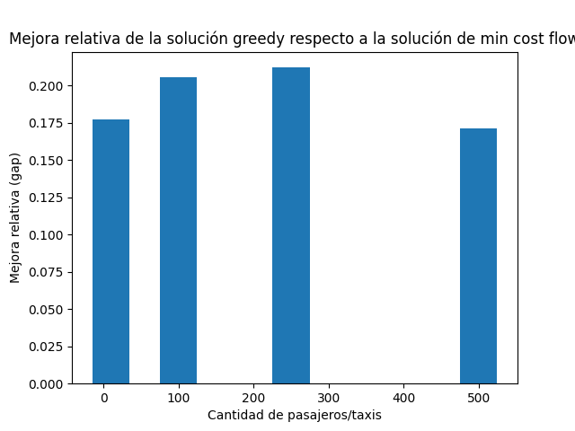
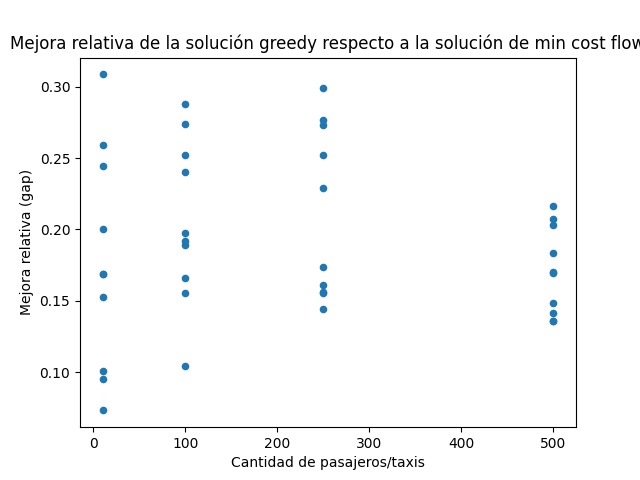
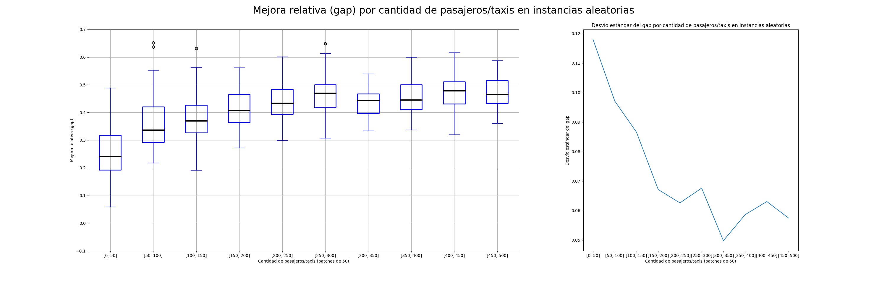
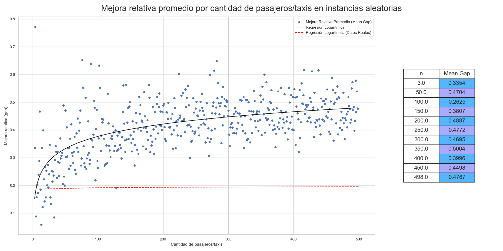
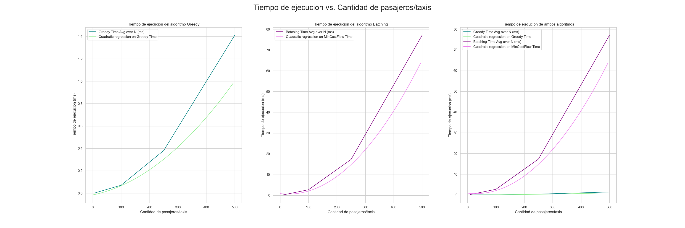
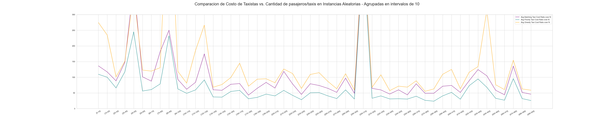

 
 
 

\newpage

## Tabla de contenidos

1. [Introducción](#introducción)
    1. [Descripción del problema y Motivación](#descripción-del-problema-y-motivación)
    2. [Estrategias de asignación](#estrategias-de-asignación)
2. [Resolución del problema](#resolución-del-problema)
    1. [Algoritmo 1: Greedy](#algoritmo-1-greedy)
        1. [Implementación FCFS](#implementación-fcfs)
    2. [Algoritmo 2: Batching Matching](#algoritmo-2-batching-matching)
        1. [Modelo para estrategia de batching](#modelo-para-estrategia-de-batching)
        2. [Implementación Batching](#implementación-batching)
    3. [Herramientas utilizadas](#herramientas-utilizadas)
        1. [Chrono C++](#chrono-c)
        2. [Google OR-TOOLS](#google-or-tools)
3. [Comparación de resultados](#comparación-de-resultados)
    1. [Obtención de resultados](#obtención-de-resultados)
    2. [Instancias Aleatorias](#instancias-aleatorias)
    3. [Análisis de resultados](#análisis-de-resultados)
        1. [Distancia total recorrida](#distancia-total-recorrida)
        2. [Tiempo de ejecución](#tiempo-de-ejecución)
4. [Un nuevo modelo: Taxi Priority](#un-nuevo-modelo-taxi-priority)
    1. [Motivación](#motivación)
    2. [Modelo y Algoritmo PrioritySolver](#modelo-y-algoritmo-prioritysolver)
    3. [Resultados](#resultados)
        1. [Comparación de soluciones en Instancias Originales](#comparación-de-soluciones-en-instancias-originales)
        2. [Comparación de soluciones en Instancias Aleatorias](#comparación-de-soluciones-en-instancias-aleatorias)
        3. [Comparación de tiempos de ejecución entre PrioritySolver y Batching en Instancias Aleatorias](#comparación-de-tiempos-de-ejecución-entre-prioritysolver-y-batching-en-instancias-aleatorias)
5. [Conclusiones](#conclusiones)
6. [Referencias](#referencias)

\newpage

# Introducción

La aparición masiva de plataformas durante los últimos años han modificado la forma en la que interactuamos con distintos servicios. Algunos ejemplos incluyen la compra on-line y el efecto en el retail tradicional; la planificación de vacaciones y reserva de alojamientos; el delivery de comidas y la realización de envíos de pequeña escala; y las nuevas soluciones de movilidad tanto sobre sistemas tradicionales, como los taxis, así como también plataformas colaborativas y de ride sharing. La masividad lograda por estas aplicaciones y plataformas se justifica no solo por los mejores precios, sino también por una mejora en la experiencia del usuario en distintos aspectos como la presencia de reviews, la comodidad en la utilización y la rápida respuesta con las respectivas soluciones. Sin embargo, es importante notar que estas diferencias no se producen solamente con ofrecer una app, sino que es el resultado de un proceso más complejo de análisis de distintos aspectos del servicio propuesto.
En este trabajo nos ponemos en el rol de consultores para una empresa que provee servicios de movilidad, cumpliendo el rol de matchmaker entre pasajeros y vehículos (taxis o particulares). En efecto, existen en el mercado local distintas alternativas de aplicaciones para conectar pasajeros con vehículos, con diversos niveles de éxito en términos de demanda y utilización. Nuestro objetivo es analizar un aspecto particular del proceso con decisiones que deben tomarse en tiempo real, evaluando el impacto en términos de la experiencia del usuario (tanto pasajeros como conductores) y de los potenciales costos involucrados.

## Descripción del problema y Motivación

En un instante dado (o en un intervalo muy pequeño de tiempo, digamos 10-15 segundos) y en una determinada área geográfica la empresa posee un número de pedidos de viajes a realizar y una cierta cantidad de vehículos disponibles para realizar viajes. Para cada pasajero podemos asumir la disponibilidad de un mínimo de información como

- el instante en el que realizó el pedido;
- la localización de origen del viaje (donde debe ser buscado);
- la localización de destino del viaje (donde debe ser llevado) o la distancia estimada del recorrido;
- una estimación de la tarifa total a cobrar por el viaje (que depende en parte de la distancia del recorrido, pero puede contener gastos extra como valijas, cantidad de pasajeros, horas pico, etc.).

Análogamente, también podemos asumir mínimamente conocer en tiempo real la localización de cada uno de los vehículos de nuestra flota, en particular la de aquellos que estén disponibles para realizar viajes. Combinando la localización de pasajeros y vehículos, podemos asumir también que conocemos la distancia a recorrer que le llevaría a cada vehículo llegar a cada posible cliente a fin de poder empezar el viaje. El problema que buscamos resolver es decidir que vehículo debe buscar a cada pasajero.
A fin de formular un modelo para la decisión en cuestión, primero formalizamos el problema. Tenemos n vehiculos disponibles, $i = 1, \dots ,n$ para cubrir n viajes de distintos pasajeros, $j = 1, \dots , n$. Por simplicidad, asumimos que el problema se encuentra balanceado en términos de oferta y demanda de viajes. En función de la información geográfica de los conductores y pasajeros, definimos dij a la distancia que debe recorrer el conductor i para empezar el viaje del pasajero $j$. Adicionalmente, para un pasajero $j = 1, \dots , n$ llamamos $v_j$ a la distancia del viaje a realizar por el pasajero $j$ y $f_j$ a la tarifa total a cobrarle por el viaje. Asumimos también que los pasajeros se encuentran ya ordenados de manera creciente en función del instante en el que realizaron el pedido.

## Estrategias de asignación

La decisión puede ser abordada con distintos enfoques. Una primera aproximación natural al problema consiste en atender a los pasajeros uno a uno siguiendo el criterio First Come, First Served (FCFS), y tomar para cada pasajero una decisión greedy asignando el conductor disponible más cercano. En base a nuestras definciones, esta estrategia consiste en los siguientes pasos:
-  considerar a los pasajeros por orden de llegada;
-  a cada pasajero asignar el vehículo más cercano;
-  cada vehículo debe ser usado por exactamente un pasajero.
Esta corresponde a la estrategia aplicada actualmente por la empresa.

Sin embargo, aún con un contexto de toma de decisión en tiempo real, si el problema presenta un volumen de demanda significativo es posible modificar el proceso aplicando la idea de matching si
se esperan algunos segundos y se arma un batch.

Es posible modificar el proceso aplicando la idea de matching si se esperan algunos segundos y se arma un batch. El concepto detrás de esta idea es simple: dentro de los parámetros permitidos, tratar de agrupar varios pedidos y, en lugar de tomar decisiones locales a cada pasajero, reformular el problema de manera global y tomar una decisión conjunta.

Para ampliar y mejorar la resolución del problema, se puede observar la <u>[estrategia de Uber](https://www.uber.com/us/en/marketplace/matching/)<u> que consiste en agrupar los viajes en batches de manera de minimizar la distancia total recorrida por los vehículos. 

En nuestro caso, podemos asumir que los $n$ vehículos disponibles y los $n$ pasajeros solicitan un viaje en un lapso de tiempo pequeño, algunos pocos segundos, en los cuales el correspondiente usuario está esperando una repuesta (ya sea pasajero, con su vehículo asignado, o un vehículo, con su pasajero). Luego, el objetivo es formular un modelo que tome una decisión global, indicando qué vehículo es asignado a cada pasajero.
Inicialmente, consideramos como métrica de éxito la minimización de la distancia recorrida por los vehículos hasta la ubicación de su pasajero asignado. Dado que asumimos la oferta y demanda balanceada, todos los pedidos deben ser cumplidos. Nuestro objetivo es proveer evidencia basándonos en datos y metodología formal respecto a la mejora en la distancia total recorrida por los vehiculos. Esta métrica se puede utilizar como un proxy de los costos y tiempos de espera de los pasajeros, bajo la hipótesis que la distancia tiene algún tipo de correlación con estos otros factores.

\newpage

# Resolución del problema

Contamos con un desarrollo básico nuestro problema, incluyendo una clase TaxiAssignmentInstance que se encarga de leer la definición de una instancia del problema de un archivo de entrada. La misma contiene los siguientes atributos:

- `n`: cantidad de vehículos/pasajeros.
- `taxis_position: vector<pair(double,double)>` de $n$ elementos, donde la posición $i$ tiene la localización en términos de longitud y latitud del taxi $i, i = 1, \dots , n$.
- `paxs_position: vector<pair(double,double)>` de n elementos, donde la posición $j$ tiene la localización en términos de longitud y latitud del pasajero $j, j = 1, \dots , n$.
- `paxs_trip_dist: vector<double>`, donde la posición j tiene la distancia (en kms) del viaje a realizar por el pasajero $j, j = 1, \dots , n$.
- `paxs_tot_fare: vector<double>`, donde la posición j tiene la tarifa total (en USD) del viaje a realizar por el pasajero $j, j = 1, \dots , n$.
- `dist: vector<vector<double>>` con una matriz que en la posición $(i,j)$ posee la distancia $d_ij$ (en kms) que debe recorrer el vehículo $i$ para empezar el viaje del pasajero $j, i,j = 1,\dots,n.$ Notar que los pasajeros están representados por las columnas $(j = 1,\dots,n)$.

Para la evaluación del problema, se cuenta con 4 sets de instancias de distintos tamaño, para modelar escenarios variados de demanda. Las mismas deben ser utilizadas para comparar la efectividad de nuestro enfoque y realizar una comparación extensiva entre el método de FCFS y el de matching. Las caraceterísticas de las instancias son:

- `small`: $n = 10$;
- `medium`: $n = 100$; 
- `large`: $n = 250$; 
- `xl`: $n = 500$.

Cada grupo posee 10 instancias distintas, a fin de agregar variabilidad en los escenarios considerados.

A partir de estas instancias, se obtiene un conjunto discreto de resultados en $n$, por lo que para expandir y generalizar la evaluación de los resultados, se generaron tambien, para cada $n \in [3, 500]$, 10 instancias con datos aleatorios de las mismas características que las instancias de los sets de datos originales. Estas instancias se utilizaron para evaluar el comportamiento de los algoritmos a medida que aumenta la cantidad de vehículos y pasajeros de forma mas continua.

\newpage

## Algoritmo 1: Greedy Solver (FCFS)

Como plantea la consigna, el primer approach a la asignacion de taxis a pasajeros se moldea a partir de una estrategia FCFS (First Come, First Served). En este caso, se considera a los pasajeros por orden de llegada y a cada pasajero se le asigna el vehículo más cercano.

### Implementación FCFS

El algoritmo comienza creando una instancia de la clase `GreedySolver` y guarda la instancia del problema de asignación de taxis y su valor objetivo en variables internas. También inicializa el estado de la solución y el tiempo de ejecución.

El método `solve()` es el corazón del algoritmo. Comienza inicializando una solución vacía, representada por el objeto `TaxiAssignmentSolution`. Luego, itera sobre cada pasajero en orden ascendente. Para cada pasajero, se busca el taxi más cercano que __aún no haya sido asignado__ a otro pasajero. Esto se realiza mediante un bucle que busca el primer taxi disponible. Una vez encontrado, se asigna ese taxi como el mínimo temporal y se procede a comparar la distancia entre el taxi mínimo y el pasajero actual con la distancia de otros taxis no asignados. Si se encuentra un taxi más cercano, se actualiza el taxi mínimo y su distancia.

Después de asignar todos los pasajeros, se registra el tiempo de ejecución, el valor objetivo y el estado de la solución. El estado de la solución es analogo al descripto en la [documentación de `OR-TOOLS`](http://google.github.io/or-tools/python/ortools/graph/pywrapgraph.html#MinCostFlowBase).

    enum Status {
        NOT_SOLVED,
        OPTIMAL,
        FEASIBLE,
        INFEASIBLE,
        UNBALANCED,
        BAD_RESULT,
        BAD_COST_RANGE
    };

\newpage

## Algoritmo 2: Batching Matching

La idea detrás de una estrategía de batching es agrupar los viajes de los pasajeros en grupos de forma tal que se minimice la distancia total recorrida por los taxis. Para esto, se plantea un modelo de optimización que resuelve el problema de encontrar el agrupamiento óptimo de los viajes de los pasajeros.

### Modelo para estrategia de batching 

Para la estrategia de batching, se plantea una red de flujo de costo mínimo, donde los nodos representan los taxis y los pasajeros, y las aristas representan los viajes que se pueden realizar. Cada arista tiene un costo asociado, que es la distancia que debe recorrer el taxi para llegar al pasajero. Además, cada arista tiene una capacidad asociada, que es la cantidad de viajes que puede realizar el taxi. La capacidad de las aristas que conectan los taxis con los pasajeros es $1$, ya que cada taxi solo puede realizar un viaje. La capacidad de las aristas que conectan los pasajeros con los taxis es la cantidad de taxis disponibles, ya que cada pasajero puede ser asignado a cualquier taxi. Por último, se agrega un nodo fuente ($s$) y un nodo sumidero ($t$), que representan los viajes que se pueden realizar. El nodo fuente tiene una arista que lo conecta con cada taxi, con capacidad $1$ y costo $0$. El nodo sumidero tiene una arista que lo conecta con cada pasajero, con capacidad $1$ y costo $0$. El objetivo es encontrar el flujo de costo mínimo que maximice la cantidad de viajes realizados.

El grafo resultante $G$ tiene la siguiente estructura:

$$
G = (V, E)
$$

\newpage

Donde $V$ es el conjunto de nodos y $E$ es el conjunto de aristas. 

Los nodos se dividen en 3 conjuntos:

$$
V = \{V_{taxis}, V_{pasajeros}, V_{fuente-sumidero}\}
$$

$V_{taxis}$ es el conjunto de nodos que representan a los taxis, $V_{pasajeros}$ es el conjunto de nodos que representan a los pasajeros y $V_{fuente-sumidero}$ es el conjunto de nodos que representan a la fuente y al sumidero. Los nodos de $V_{taxis}$ y $V_{pasajeros}$ se definen de la siguiente forma:

$$
\begin{aligned}
V_{taxis} &= \{t_1, t_2, ..., t_m\} \\
V_{pasajeros} &= \{p_1, p_2, ..., p_n\}
\end{aligned}
$$

Luego, el conjunto de aristas $E$ se define de la siguiente forma:

$$
E = (t_i, p_j, d_{ij}, 1) \forall t_i \in V_{taxis}, p_j \in V_{pasajeros}
$$

Siendo $d_{ij}$ la distancia entre el taxi $t_i$ y el pasajero $p_j$.

### Implementación Batching 

Para implementar el modelo de batching, se utilizó la librería [`OR-TOOLS`](https://developers.google.com/optimization/). Esta librería permite resolver problemas de optimización combinatoria, como el problema de flujo de costo mínimo. Para resolver el problema, se encapsuló la lógica de la librería en una clase llamada `BatchingSolver` que implementa el método `solve()`. 

La clase BatchingSolver tiene dos constructores: uno sin argumentos y otro que recibe una instancia de `TaxiAssignmentInstance`. Estos constructores inicializan los atributos de la clase, como el valor objetivo, el estado de la solución y el tiempo de solución. El método `setInstance()` se utiliza para establecer la instancia de `TaxiAssignmentInstance` en el atributo `_instance` de la clase.

El método `solve()` se encarga de resolver el problema de asignación de taxis utilizando un grafo de flujo de costo mínimo. Para ello, se lleva a cabo el proceso de creación de la red de flujo de costo mínimo por parte del método `_createMinCostFlowNetwork()` que se resuelve el problema utilizando el método `Solve()` del objeto `MinCostFlow` de la biblioteca `OR-TOOLS`. Luego, si la solución es óptima, se asignan los taxis a los pasajeros correspondientes y se calcula el costo de la solución.

El método `_createMinCostFlowNetwork()` se encarga de crear la red de flujo de costo mínimo para el problema de asignación de taxis. Esto implica la definición de los nodos, las capacidades, los costos unitarios y los suministros de la red. Se establecen los arcos entre los taxis y los pasajeros, y se asignan los suministros correspondientes a los nodos de los taxis y los pasajeros.

Primero, se obtiene el número de taxis y pasajeros de la instancia guardada en el atributo _instance. Luego se crean varios vectores que almacenarán la información de la red, como los nodos de inicio, los nodos de fin, las capacidades y los costos unitarios.

El siguiente paso es llenar los vectores start_nodes, end_nodes y unit_costs con la información necesaria para crear los arcos de la red. Los vértices de la red se indexan de $0$ a $2n-1$, donde los primeros n representan a los taxis y los últimos n representan a los pasajeros.

Se recorren todos los taxis y pasajeros y se establecen las conexiones entre ellos. Cada conexión representa un arco en la red de flujo de costo mínimo. Los arcos tienen una capacidad de $1 $(ya que cada taxi solo puede atender a un pasajero) y un costo unitario que se calcula como $10$ veces la distancia entre el taxi y el pasajero. El factor de escala de 10 se utiliza para que los costos sean enteros y no de tipo `double`.

Después de llenar los vectores con la información de los arcos, se crea la red de flujo de costo mínimo en el atributo `_min_cost_flow` utilizando el objeto `MinCostFlow`. Se agrega cada arco a la red utilizando el método `AddArcWithCapacityAndUnitCost()`.

Luego se establecen los suministros de cada nodo en la red utilizando el método `SetNodeSupply()`. Los taxis tienen un suministro de $1$, lo que indica que pueden atender a un pasajero, mientras que los pasajeros tienen un suministro de $-1$, lo que indica que necesitan ser atendidos por un taxi.

Una vez que se han creado todos los arcos y se han establecido los suministros de los nodos, la red de flujo de costo mínimo está lista para ser utilizada en la resolución del problema.

Al implementar nuestro modelo de batching, los nodos de fuente y sumidero no fueron necesarios ya que a diferencia de los grafos a los que estabamos acostumbrados a trabajar con caminos, la red de flujo de costo mínimo no requiere de un nodo de inicio y un nodo de fin.

\newpage

## Herramientas utilizadas

### Chrono C++ 

Para cronometrar el tiempo de ejecución de los algoritmos, se utilizó la librería `chrono` de C++. Esta librería permite medir el tiempo de ejecución de un programa en nanosegundos. Para utilizar esta librería, se creó una clase llamada `Timer` que encapsula la lógica de la librería. Esta clase tiene dos atributos: `start` y `end`, que representan el tiempo de inicio y el tiempo de finalización de la medición. El método `start()` se encarga de establecer el tiempo de inicio de la medición, mientras que el método `stop()` se encarga de establecer el tiempo de finalización de la medición. La presición de la medición se estableció en milisegundos.

La forma en la que se utilizó `chrono` es la siguiente:

    auto start = std::chrono::steady_clock::now();
    * * * Código a cronometrar * * *
    auto time = std::chrono::duration<double, std::milli>(end - start).count();

### Google `OR-TOOLS`

Para implementar el modelo de batching, se utilizó la librería [`OR-TOOLS`](https://developers.google.com/optimization/). Esta librería permite resolver problemas de optimización combinatoria, como el problema de flujo de costo mínimo. Para resolver el problema de Batching se utilizo la clase `MinCostFlow` de la librería. Esta clase representa un grafo de flujo de costo mínimo. Para crear la red de flujo de costo mínimo, se utilizó el método `AddArcWithCapacityAndUnitCost()` de la clase `MinCostFlow`. Este método se encarga de agregar un arco a la red de flujo de costo mínimo. El método `Solve()` de la clase `MinCostFlow` se encarga de resolver el problema de flujo de costo mínimo.

# Comparación de resultados

## Obtención de resultados 

Para obtener los resultados, se corrieron los dos algoritmos para cada instancia de cada set de datos y se guardaron los resultados de cada corrida. Luego, se calculó el valor objetivo de cada corrida y se guardó en un archivo csv. El código utilizado para obtener los resultados se encuentra en el archivo `src/output/results.csv`.

La siguiente tabla detalla un resumen de los resultados obtenidos:

|       |       n |   greedy_cost |   min_cost_flow_cost |   greedy_time |   min_cost_flow_time |
|:------|--------:|--------------:|---------------------:|--------------:|---------------------:|
| count |  40     |        40     |               40     |     40        |              40      |
| mean  | 215     |       696.783 |              587.278 |      0.442864 |              23.525  |
| std   | 187.903 |       583.801 |              498.485 |      0.538287 |              30.6385 |
| min   |  10     |        29.5   |               23.7   |      0.001958 |               0      |
| 25%   |  77.5   |       219.875 |              184.925 |      0.046667 |               1.5    |
| 50%   | 175     |       572.8   |              471.85  |      0.207666 |               8.5    |
| 75%   | 312.5   |      1088.7   |              912.875 |      0.607448 |              34      |
| max   | 500     |      1737.4   |             1521.8   |      1.43354  |              82      |

A simple vista podemos ver que la media del valor objetivo de la solución obtenida por el algoritmo de batching es menor que la del algoritmo greedy ($587.278$ vs $696.783$). Esto indica que el algoritmo de batching obtiene mejores resultados que el algoritmo greedy. Sin embargo, el tiempo de ejecución del algoritmo de batching es mucho mayor que el del algoritmo greedy. Esto se debe a que el algoritmo de batching utiliza un modelo de programación lineal entera, mientras que el algoritmo greedy es mucho más simple y no requiere de un modelo matemático.

\newpage

## Análisis de resultados 

### Distancia total recorrida 

Para comparar los resultados obtenidos por los algoritmos, se utiliza el valor objetivo de la solución. En cada caso, se mide la mejora porcentual obtenida. Sean $z_b$ y $z_g$ el valor de la función objetivo de una solución del modelo para el batching y el de FCFS, respectivamente. Definimos la mejora relativa y aplicamos la formula a los resultados obtenidos:
$$
    \%\text{gap}= \frac{z_g - z_b}{z_b}
$$

|   n |   greedy_cost |   min_cost_flow_cost |      gap |
|----:|--------------:|---------------------:|---------:|
|  10 |         46.93 |                40.06 | 0.177322 |
| 100 |        337.31 |               280.63 | 0.205883 |
| 250 |        849.6  |               701.6  | 0.212157 |
| 500 |       1553.29 |              1326.82 | 0.171215 |

A simple vista parece ser que el algoritmo de batching obtiene mejores resultados que el algoritmo greedy, ya que la mejora relativa es positiva en todos los casos. Sin embargo, no podemos afirmar esto sin hacer un test de hipotesis. Buscaremos observar entonces la progresión de la mejora relativa a medida que aumenta la cantidad de pasajeros. Para obtener una mejor idea de la distribución de los datos, se graficó un histograma de los valores objetivo de las soluciones obtenidas por cada algoritmo asi tambien como sus distribuciones para cada $n$ pasajeros.

<!---->

<!---->

<!---->

|   n |   count |     mean |       std |       min |      25% |      50% |      75% |      max |
|----:|--------:|---------:|----------:|----------:|---------:|---------:|---------:|---------:|
|  10 |      10 | 0.177322 | 0.0769256 | 0.0732394 | 0.113712 | 0.169066 | 0.233651 | 0.308642 |
| 100 |      10 | 0.205883 | 0.0574211 | 0.104009  | 0.171945 | 0.194773 | 0.249033 | 0.287764 |
| 250 |      10 | 0.212157 | 0.0599257 | 0.144362  | 0.157622 | 0.201565 | 0.267717 | 0.299222 |
| 500 |      10 | 0.171215 | 0.0305612 | 0.135713  | 0.143316 | 0.170003 | 0.198171 | 0.216486 |

Es en este gráfico se puede ver que el desvío estándar de las mejoras relativas decrece a medida que aumenta la cantidad de pasajeros. Esto indica que el algoritmo de batching obtiene soluciones más __consistentes__ que el algoritmo greedy a mayor cantidad de pasajeros. Sin embargo parece ser que la media de las mejoras relativas disminuye a medida que aumenta la cantidad de pasajeros.

Para expandir el análisis, se realizó la misma evaluación sobre las ~5000 instancias generadas aleatoriamente. 

\newpage

### Instancias aleatorias

<!---->

<!---->

<!---->

<!---->

Nuevamente se observa que el desvío estándar de las mejoras relativas decrece a medida que aumenta la cantidad de pasajeros. Para observar la tendencia de la mejora relativa a medida que aumenta la cantidad de pasajeros, se realizó una regresión logarítmica sobre la media de las mejoras relativas para cada cantidad de pasajeros.

A pesar de tener instancias con $n = 3, \dots, 498$, la tabla de la figura muestra las medias de las mejoras relativas para las cantidades de pasajeros de 50 en 50 para reducirla. Al Scatter Plot lo acompaña una regresión logarítmica a partir de la media de las mejoras relativas para cada cantidad de pasajeros para poder observar la tendencia de la mejora relativa a medida que aumenta la cantidad de pasajeros.

A partir de estos resultados, interpretamos que, a medida que la cantidad de pasajeros crece, la mejora relativa de la solución obtenida por el algoritmo de batching respecto a la solución obtenida por el algoritmo greedy tiende a crecer cada vez mas lento. El valor de la mejora relativa tiende de forma logaritmica en un valor cercano a $0.5$.

<!--
|   n |     mean |
|----:|---------:|
|   3 | 0.335435 |
|  50 | 0.470381 |
| 100 | 0.262508 |
| 150 | 0.38071  |
| 200 | 0.488713 |
| 250 | 0.477224 |
| 300 | 0.469546 |
| 350 | 0.500416 |
| 400 | 0.399574 |
| 450 | 0.449788 |
| 498 | 0.476677 |
-->

\newpage

### Tiempo de ejecución 

La complejidad temporal del algoritmo greedy es $O(n^2)$, ya que en cada iteración se debe calcular la distancia entre cada par de pasajeros. La complejidad del algoritmo de batching es $O(n^2*m*log(n*C))$ por la complejidad de resolver el flujo máximo de costo minimo que esta descripta en la [documentación de la clase `MinCostFlow` de `OR-TOOLS`](https://developers.google.com/optimization/reference/graph/min_cost_flow) a partir del algoritmo propuesto en "Finding Minimum-Cost Circulations by Successive Approximation" de Goldberg y Tarjan.

De modo empírico, se observó que el algoritmo greedy es mucho más rápido que el algoritmo de batching. Obtenemos para el dominio $n = 1, \dots ,500$, la imagen del tiempo de ejecución del algoritmo greedy esta entre $0.001$ y $2.66279$ milisegundos, mientras que la imagen del tiempo de ejecución del algoritmo de batching esta entre $0.0$ y $151.0$ milisegundos. En el gráfico el tiempo de ejecución es el del promedio de las 10 ejecuciones de cada algoritmo para cada cantidad de pasajeros, las imagenes para estos resultados se encuentran entre $0$ y ~$1$ ms para el algoritmo greedy y entre $0$ y ~$70$ ms para el algoritmo de batching.

\newpage

# Un nuevo modelo: Taxi Priority

## Motivación

En base a encuestas realizadas a los conductores en general, las aplicaciones sugieren muchas veces viajes que demandan una distancia considerable para llegar a la ubicación del pasajero, para luego realizar un muy viaje corto en comparación. En este sentido, la sensación de los conductores es que es mucho el costo de buscar el pasajero, ya sea en costo específico o en el tiempo utilizado y que podrían destinar a un viaje más rentable, en relación al beneficio obtenido por el viaje en sí mismo.

Para mitigar este problema, se planteo un nuevo algoritmo para la asignación de Taxis a Pasajeros teniendo en cuenta:

- La distancia entre el Taxi y el Pasajero
- La distancia del viaje del Pasajero

De esta forma, nuestra nueva metrica a optimizar es una función de la distancia del viaje y la distancia del Taxi al Pasajero resultando en un algoritmo _Taxi Centered_, es decir que prioriza los viajes más rentables para los conductores.

## Modelo y Algoritmo `PrioritySolver`

Como la cuestión a resolver es minimizar el costo total de asignar los Taxis a los Pasajeros, se define la función de costo unitario como la distancia entre el Taxi y el Pasajero dividido la distancia del viaje del Pasajero. De esta forma, se busca minimizar el costo unitario de asignar un Taxi a un Pasajero. Por ejemplo, si tenemos un Taxi $t_i$ y un Pasajero $p_j$ donde:

- La distancia entre el Taxi y el Pasajero es $\text{Distance}(t_i, p_i) = 10$
- La distancia del viaje del Pasajero es $\text{Distance}(p_i) = 20$

El costo unitario de asignar el Taxi al Pasajero es $\frac{\text{Distance}(t_i, p_i)}{\text{Distance}(p_i)} = \frac{10}{20} = 0.5$. 

A modo de implementacíon, optamos por multiplicar el costo unitario por 100, para poder trabajar con números enteros, pero a su vez, mantener cierta precisión al estar hablando de un ratio de distancias. De esta forma, el costo unitario queda definido como:

$$
\text{Taxi Cost}(t_i, p_j) = 100 * \frac{\text{Distance}(t_i, p_j)}{\text{Distance}(p_j)} \quad \forall t_i \in T, p_j \in P
$$

La relación entre la distancia del Taxi al Pasajero y el costo unitario es directamente proporcional, es decir que a mayor distancia, mayor costo unitario. Por otro lado, la relación entre la distancia del viaje del Pasajero y el costo unitario es inversamente proporcional, es decir que a mayor distancia, menor costo unitario. De esta forma, buscamos minimizar el costo unitario, es decir que se priorizan los Taxis más cercanos a los Pasajeros que tienen viajes más largos. Llamemos entonces al total de costos unitarios de asignar los Taxis a los Pasajeros para una solución como "Costo de Taxistas".

Este problema lo podemos modelar nuevamente como un problema de flujo de costo mínimo, donde los nodos son los Taxis, los Pasajeros y el nodo fuente y sumidero. Las aristas son las conexiones entre los Taxis y los Pasajeros, pero en este caso el costo de cada arista es el nuevo costo unitario de asignar el Taxi al Pasajero. La capacidad de cada arista es 1, ya que cada Taxi solo puede ser asignado a un Pasajero.

\newpage

## Resultados

En la experimentación se plantearon las siguientes cuestiones a comparar a través de los modelos.

- Los costos objetivos de las soluciones obtenidas por cada modelo.
- La nueva metrica de Costo de Taxistas.
- Los tiempos de ejecución de cada modelo.

### Comparación de soluciones en Instancias Originales

Inicialmente evaluamos los tres modelos en las instancias originales.

Como la función de costo unitario del modelo de `Batching` es directamente proporcional con la función de costo unitario de `Priority` ya que ambas dependen directamente de la distancia entre el Taxi y el Pasajero de la siguiente forma:

$$
\begin{aligned}
\text{Batching UnitCost}(t_i, p_j) &= 10 \times \text{Distance}(t_i, p_j) \quad \forall t_i \in T, p_j \in P \\
\text{Priority UnitCost}(t_i, p_j) &= 100 \times \frac{\text{Distance}(t_i, p_j)}{\text{Distance}(p_j)} \quad \forall t_i \in T, p_j \in P
\end{aligned}
$$

Los resultados nos muestran como el modelo de `PrioritySolver` obtiene soluciones con un costo objetivo cercano, aunque mayor, al modelo de `Batching` pero de todas formas menor que el modelo `Greedy`. Como la resolución por `Batching` resulta en la asignación óptima, es esperado que su función de valor objetivo actúe de cota inferior para los otros modelos.

\newpage

### Comparación de soluciones en Instancias Aleatorias

Al igual que en la experimentación de `Batching`, se utilizaron las mismas $~5000$ instancias generadas de forma aleatoria para comparar ahora con el nuevo modelo `PrioritySolver`.

Podemos observar el mismo comportamiento que comportamiento que en las instancias originales, donde el modelo `PrioritySolver` obtiene soluciones con un costo objetivo cercano al modelo de `Batching` y menor que el modelo `Greedy`.

### Comparación de tiempos de ejecución entre `PrioritySolver` y `Batching` en Instancias Aleatorias

Como nuestro nuevo modelo resulta de una red de flujo máximo de costo minimo de la misma cantidad de nodos y arcos que el modelo de Batching, sus complejidades algoritmicas son iguales.

En la experimentación se observan comportamientos analogos en cuanto a tiempos de ejecución.

\newpage

# Conclusiones

El modelo de `PrioritySolver` prioriza los viajes más rentables para los conductores, mientras que el modelo de `Batching` prioriza los viajes más rentables para la asignación total, y el modelo `Greedy` prioriza los viajes más rentables para los pasajeros.

# Referencias

- [1] [Uber Matching Batching https://www.uber.com/us/en/marketplace/matching/](https://www.uber.com/us/en/marketplace/matching/)
- [2] [Min Cost Flow - OR-TOOLS https://developers.google.com/optimization/reference/graph/min_cost_flow](https://developers.google.com/optimization/reference/graph/min_cost_flow)
- [3] [Finding Minimum-Cost Circulations by Successive Approximation](https://dl.acm.org/doi/10.1287/moor.15.3.430) Andrew V. Goldberg, Robert E. Tarjan, (1990) Finding Minimum-Cost Circulations by Successive Approximation. Mathematics of Operations Research 15(3):430-466.
